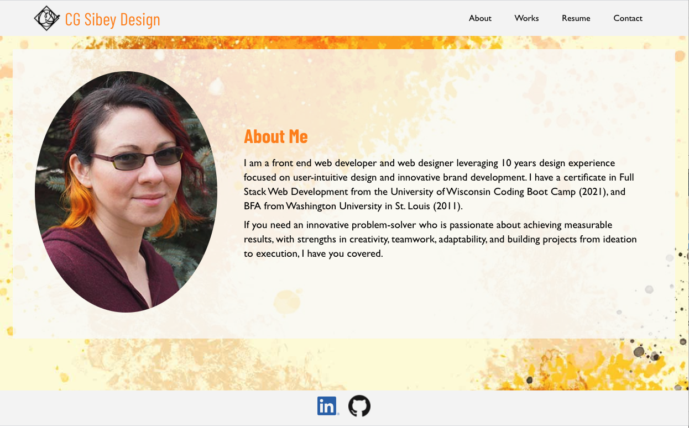

# Portfolio CGS

 
 [View Live App Here](https://cgsdesign.github.io/portfolio-cgs)
 
 [Github](https://github.com/cgsdesign/portfolio-cgs)

## Description 

For this project I reworked my portfolio to incorperate React. The site features an about section, a collection of my works with links to repos and live sites, a contact page, and section to see my skills and download my resume and graphic design portfolio. 

## Key Features
* React.js
* About: Brief Bio
* Works: Mapped collection of kew works including links to live sites and repos
* Contact: Email contact form with validation and onChange events 
* Resume: downloadable resume, design portfolio, and list of technical skills
 
## Installation
Download files from [this github repo](https://cgsdesign.github.io/portfolio-cgs). Instal [React](https://reactjs.org/docs/getting-started.html) &  [Tailwind](https://tailwindcss.com/docs/guides/create-react-app) via linked instructions.

## License
* MIT

## <a name="badge">Badges</a>

## <a name="contributing">Contributing Information</a>
* [Contributor Covenant](https://www.contributor-covenant.org/)
* Thanks to [Joey](https://github.com/Joeyrodrigues92) for clarification on onChange events.

## <a name="questions">Questions</a>
### contact me at: 
* github: [https://github.com/cgsdesign](https://github.com/cgsdesign)
* email: [cgsdesignmadison@gmail.com](cgsdesignmadison@gmail.com)
